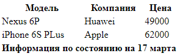
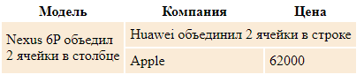

# Таблица

## Общая форма таблицы HTML

```html
<table>    
    <thead>
        <tr>
            <th>Модель</th> <th>Компания</th> <th>Цена</th>
        </tr>
    </thead>
    <tbody>
        <tr>
            <td>Nexus 6P</td> <td>Huawei</td> <td>49000</td>
        </tr>
        <tr>
            <td>iPhone 6S PLus</td> <td>Apple</td> <td>62000</td>
        </tr>        
    </tbody>
    <tfoot>
        <tr>
            <th colspan="3">Информация по состоянию на 17 марта</th>
        </tr>
    </tfoot>
</table>
```



- **`<table>`** - создание талицы
- **`<thead>`** - заголовок таблицы (не на что не влияет но упращает обращение к нему через СSS, ну и красивое)
  - **`<tr>`** - строка
  - **`<th>`** - ячейка заголовка таблицы
- **`<tbody>`** - основное тело таблицы (тоже необязательный тег)
  - **`<tr>`** - строка
  - **`<td>`** - ячейка строки таблицы
- **`<tfoot>`** - футер (подвал) таблицы. Тоже необязательная часть

## Краткая форма таблицы HTML

Часто таблицу используют в упрощенном виде:

```html
<table>   
        <tr>
            <td>Nexus 6P</td> <td>Huawei</td> <td>49000</td>
        </tr>
        <tr>
            <td>iPhone 6S PLus</td> <td>Apple</td> <td>62000</td>
        </tr>    
</table>
```

## Объединение ячеек

```html
<table>
    <thead>
        <tr>
            <th>Модель</th> <th>Компания</th> <th>Цена</th>
        </tr>
    </thead>
    <tbody>
        <tr>
            <td rowspan="2">Nexus 6P объедил <br/> 2  ячейки в столбце</td>
            <td colspan="2">Huawei объединил 2 ячейки в строке </td>
        </tr>
        <tr>              
            <td>Apple</td>
            <td>62000</td>
        </tr>
    </tbody>      
</table>
```



- **rowspan** - объединяет несколько ячеек в строке
- **colspan** - объединяет несколько ячеек в столбце

## Материалы

- [metanit.com Таблицы](https://metanit.com/web/html5/2.8.php)
