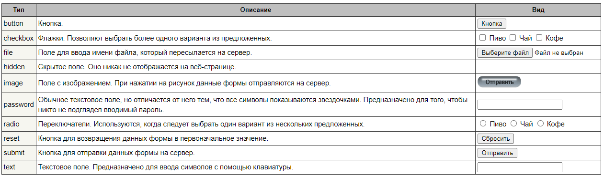

# Элементы формы

## Элемент FORM

```html
<form method="post" action="http://localhost:8080/login.php">
    <input name="login"/>
    <input type="submit" value="Войти" />
</form>
```

- **`<form>`** обозначает что внутри будет форма
  - **`<method>`** метод HTTP запроса (GET, POST)
  - **`<action>`** адрес, на который будет отправлен HTTP запрос

**PS:** *Я вообще не использую да и впринципе используется сейчас редко. Совсем необязательно чтобы форма ввода находилась в данном теге. Из плюсов использования - ты не используя JavaScript можешь отправить запрос на сервер*

## Элемент `<input>`

```html
<input type="text" name="login" value="123" placeholder="Введите..." />
```

Основной элемент для ввода данных.

- **type** указывает на тип вводимой информации
- **name** имя поля. Необходимо при передаче данных на сервер при отправке формы. Пока не важное поле.
- **value** устанавливает значение по умолчанию в текстовом поле
- **placeholder** устанавливает текст, который по умолчанию отображается в текстовом поле

Основные типы:


## Элемент `<button>`

```html
<button>Кнопка с текстом</button>
```

Основной способ отрисовать кнопку

## Список `<select>`

```html
 <select name="phone">
    <option value="iphone 6s">iPhone 6S</option>
    <option value="lumia 950">Lumia 950</option>                    
</select>
```

Элемент select создает список. В зависимости от настроек это может быть выпадающий список для выбора одного элемента, либо раскрытый список, в котором можно выбрать сразу несколько элементов.

- **`<option>`** элементы списка
  - **`value`** значение, которое будет назначено select при выборе данного пункта пользователем

## Элемент `<textarea>`

```html
 <textarea name="comment" placeholder="Введите..." cols="30" rows="7"></textarea>   
```

Элемент textarea создает многострочное текстовое поле

- **placeholder** устанавливает текст, который по умолчанию отображается в текстовом поле
- **cols** количество столбцов (ширина)
- **rows** количество строк (высота)

## Материалы

- [metanit.com Формы](https://metanit.com/web/html5/3.1.php)
- [metanit.com Элементы форм](https://metanit.com/web/html5/3.2.php)
- [metanit.com Кнопки](https://metanit.com/web/html5/3.3.php)
- [metanit.com Текстовые поля](https://metanit.com/web/html5/3.4.php)
- [htmlbook.ru Атрибут type](https://htmlbook.ru/html/input/type)
- [metanit.com Список select](https://metanit.com/web/html5/3.11.php)
- [metanit.com Textarea](https://metanit.com/web/html5/3.12.php)
